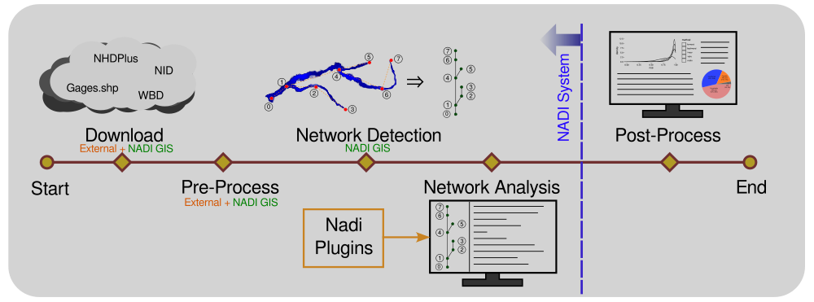

# Nadi System
[](https://joss.theoj.org/papers/dccad16648a06737cf6c33240943fd67)
[](https://doi.org/10.5281/zenodo.16956958)

Collection of Utilities to do Network Analysis and Data Integration. This is made targeting analysis of point data in a river system but it should work for any network analysis that work on directed tree network.

The main component of the NADI System is the DSL. It can be used for network based data analysis. The repo contains the tools for using nadi through Command Line Interface (CLI), Integrated Development Environment (IDE), `mdbook` (documentation writing tool), or as a python library.

The overall NADI workflow is shown below. This repository contains the components for the Network Analysis part of the system.



## Theory
The data associated with points in a river system is loaded as a network, and along side the functions loaded through the plugins, the Domain Specific Programming language (DSL) can be used to run different arithmetic, logical, or functional analysis on the metadata of the points.

This allows us to do network based data analysis quickly, with intuitive syntax compared to using general purpose programming language like Python. But the general purpose languages have more flexibility, so a way to couple with them is provided through the plugin mechanism.

## Further Reading
Please refer to the [NADI Book](https://nadi-system.github.io/) for details on the key concepts, the syntax of the language, and other components of the NADI System.

For developers the API documentation is on [docs.rs](https://docs.rs/nadi_core/latest/nadi_core/index.html).

# Usage Instructions

Video Demo: https://www.youtube.com/watch?v=qKsrigRrPKo
Web User Manual: https://nadi-system.github.io
PDF User Manual: https://nadi-system.github.io/data/nadi-book.pdf
Dev Reference: https://docs.rs/nadi_core/latest/nadi_core/

# Installation

Prebuilt binaries are available for windows in the releases page. Use the `nadi-ide` binary for the GUI, refer to Nadi Book for details on other binaries.


If you want to build it from source, which works on Linux, Windows, MacOS and Android (Termux, but without the IDE), clone this repository. And build it with cargo as follows:

```bash
git clone https://github.com/Nadi-System/nadi-system
cd nadi-system
cargo build --release
```

The compiled binaries will be in `target/release` directory. You can run `nadi-ide` from there for GUI, or `nadi` for CLI.

Or you can directly do the following:
```bash
cargo run --release --bin nadi-ide
```

## OS Specific Instructions
Some OS might not come with the system dependencies required for the NADI System.

One dependencies of `nadi-ide` ([`rfd`](https://docs.rs/rfd/latest/rfd/)) suggests the following dependencies:

| Distribution    | Installation Command     |
|-----------------|--------------------------|
| Fedora          | dnf install gtk3-devel   |
| Arch            | pacman -S gtk3           |
| Debian & Ubuntu | apt install libgtk-3-dev |

Besides that you might need the following for Debian:
- `build-essential`
- `libatk1.0-0`
- `libglib2.0-dev`

If you cannot compile the program in your OS, please make an issue, even if you're able to solve it, that will help other people using the same OS.

The developer has only tested compilation on, Arch Linux and Windows OS.

# Tests
You can run tests using the cargo command, this will run the tests in all the components as well as their documentation.

```bash
cargo test
```

## Components
Nadi System consists of the following components:
## Nadi Core
Core library in Rust, it has the basic data structures and the logic for the plugin system.

## Nadi Plugin
This is a macro library that facilitates writing nadi plugins.

## Nadi CLI
Command Line Interface (CLI) to run nadi tasks file from terminal. Can visualize the parsed tasks, or run them.

## Nadi IDE
Integrated Development Environment (IDE) for Nadi tasks. You can use this for writing your nadi tasks script, browse documentations, visualize network, run tasks, etc. You do not need to install any other program if you want to use Nadi by itself if you install it.

## Nadi Python Library
You can install this and run nadi from python, you can use python syntax to define your own functions as well as run the functions loaded from nadi plugins. This gives better flexibility for research purposes, and for prototyping.

## Plugins
There are some plugins that are given by default called internal plugins. And some you can get from [`nadi-plugins-rust`](https://github.com/Nadi-System/nadi-plugins-rust) repository. 

## Nadi GIS
Geographic Information System (GIS) tool for nadi. It can help download stream lines (NHDPlus), USGS streamgages, basins, etc as well as run network detection algorithm for detecting network that is the backbone of nadi system.

Nadi GIS is available as a command line utility as well as a QGIS plugin.

# Contributing
You can contribute to NADI System even without coding experience in Rust by reporting bugs, suggesting features, and helping with documentation.

Please refer to [CONTRIBUTING.md](./CONTRIBUTING.md) for further details on specific roles and tasks you can do. For developers, refer to the Future Work section below for things I would appreciate help with (but please make an issue and tell me before you start).

And please refer to [architecture.md](./architecture.md) file to read how the components of the NADI are arranged in this repository.

# Future Work
## Beginner work: More of these the better
- Write more tests so we don't break anything important in future.
- Write more plugin functions. Depends on users use cases.
- Write example problems and solutions using NADI.

## Easy work: Plugin function modifications
- [ ] Convert many node/network functions to env function by taking the attribute/series etc directly now.
- [ ] Convert any functions that take Vec<String> or similar that could use `*args` syntax now.

## User Interface and Helper Tools
- [ ] Write layout algorithm for the directed graph (not just trees), take algorithms from Graphviz and other papers.
- [ ] Implement more functionality in the `jupyter kernel`.
- [x] Write a `nadi-server` CLI tool, that opens a server. It opens up an API where users can send tasks to run, and it can return the output from that.
- [ ] Server should have `mutable` and `immutable` option. In the immutable option users can only run immutable functions.
- [ ] Write editor modes for nadi, maybe using `lsp` so users can expand it to their editors with minimal work.
  - Currently, besides the NADI IDE, there are some syntax highlight available for web (through highlight.js), and sublime syntax files in `extra/syntax-highlight` directory.
  - There is no intelligent analysis of scripts, you can only run it to get errors. Better error handling while parsing, and then 


## Language Design work
- [ ] Implement type check for series/timeseries and user defined functions. The type information is not used in the language itself, but just asserted once before assignment to avoid any errors.
- [ ] Make Template and Timeline as other types the functions/expressions can take and return. Maybe add t"temp {x}" type syntax for template string. It gets passed as Template instead of normal strings. That saves the computation required to parse the template all the time from String. Same for Timeline. But the timeline is already messed up, so idk what to do with it.
- [ ] Implement Structs, add Date and Time as structs, add structs to the expression result and function input as well. For function Input, the structs made in the same plugin can be used directly, otherwise it will be converted to AttrMap for compatibility. We need to think about how to implement that. Could be just struct with name and AttrMap for fields. Struct definitely needs types and default values.
