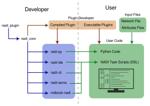
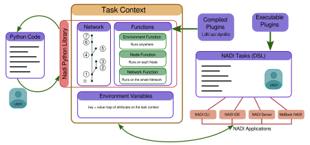

# Architecture

This document describes high level architecture of the NADI System. The intention here is to make it easier to familiarize yourself about the code base before jumping into the source code.

## Nadi System and Components

The main components of the Nadi System are:

| Component     | Location        | Description                  |
|---------------|-----------------|------------------------------|
| `nadi_core`   | `./nadi_core`   | Core rust library            |
| `nadi_plugin` | `./nadi_plugin` | Proc macros for nadi plugins |
| `nadi-cli`    | `./nadi-cli`    | Command Line tool            |
| `nadi-py`     | `./nadi-py`     | Python library               |
| `nadi-ide`    | `./nadi-ide`    | IDE for NADI DSL             |

The figure below shows the components that are user-facing, and the libraries/packages internally used for them.

Most important library is the `nadi_core` library, it contains the data types and the APIs for user facing programs, it also uses `nadi_plugin` internally and re-exports it. `nadi_plugin` provides the proc macros to write plugins to NADI. `nadi-cli` provides the Command Line Interface to run `nadi` DSL while `nadi-ide` provides an Integrated Development Environment.

User are expected to use either the Task System (the DSL), or python to do the network analysis. While the plugin developers will use `nadi_core` and `nadi_plugin` (through `nadi_core`) to write the plugins that users will load into the function.

For more details on each component refer to the [Introduction](https://nadi-system.github.io/introduction.html). As well as the [Software Architecture on the Developer Reference](https://nadi-system.github.io/devref/architecture.html)

The inner workings of the NADI System to run the NADI DSL are shown in the figure below.

Basically, the task context is the main runtime environment for the DSL. The Context contains a Network (starts as empty network), functions loaded from the plugins, and the environmental variables. As the DSL is executed Task by Task, the context is modified with mutable functions or assignment operator. For example running a `network load_file(...)` will load a network from file and save that in the context. When a user runs a `node` task, the expression/function is run on each node of the network in the current context.

If a user is using NADI from Python library instead of the DSL, then they have access to the Functions, and the data types to generate the Network from files/strings/edges. But they don't have access to environment variables (they can use python variables), and other syntax advantages of DSL. They also have to run the node functions in loop yourself.
Because of this `nadi-py` should provide data types from NADI, as well as the functions from the plugins as callable objects in python along side their documentation. We use `maturin` to generate the python bindings from the rust code.

