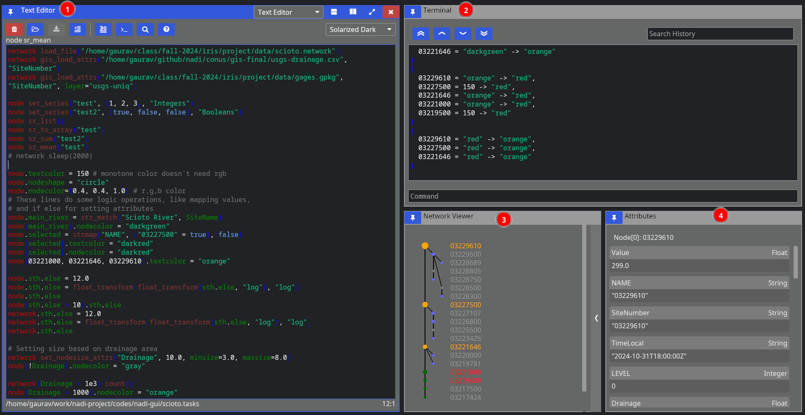
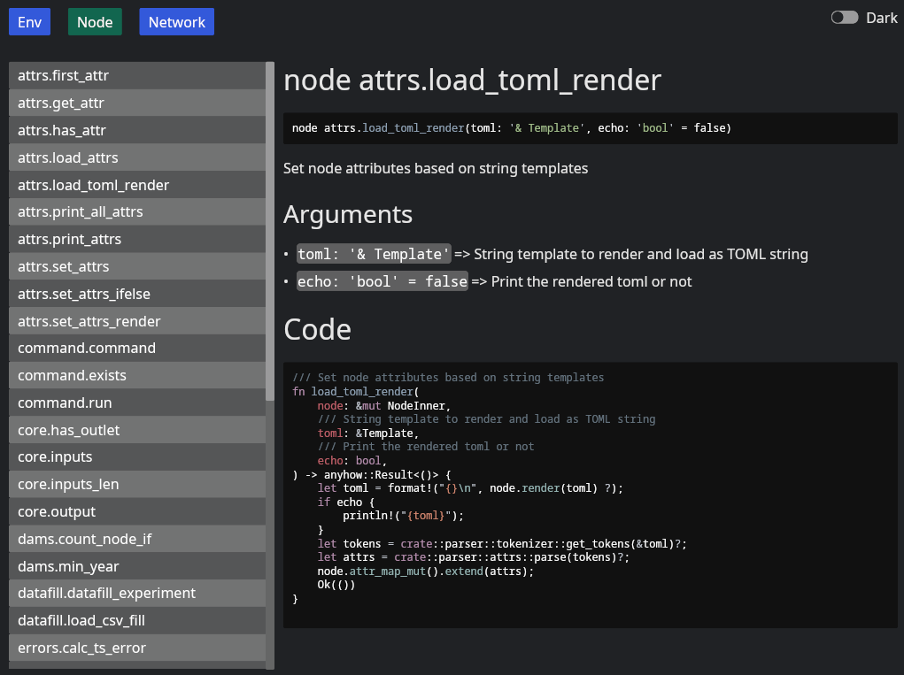

# NADI IDE
Integrated Development Environment (IDE) for Nadi. This is a Graphical User Interface (GUI) for the Nadi system. You can install this, and the plugins of your choice, and you should be able to use nadi system for network analysis.

The screenshot below shows 4 components (text editor, terminal, network viewer and attributes view for nodes). You can rearrange them (drag & drop), close them and reopen it.

The button on the top right lets you split your current window, so you can open other windows. It's a tilling window manager style setting, if you are familiar with them.

You can also open some of the tabs there as independent programs. For example, `nadi-help` can be opened and you can browse the functions like shown below.

Advantages of opening them in the IDE is that they are connected to each other and can communicate. For example, you can press `help` button on editor to get the help of a function open in the `help` panel. While opening them separately do not have that.
