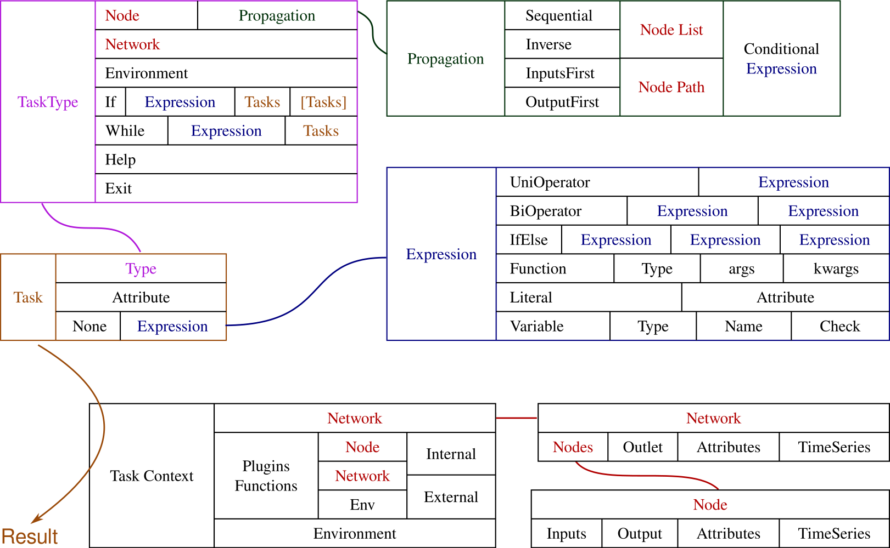
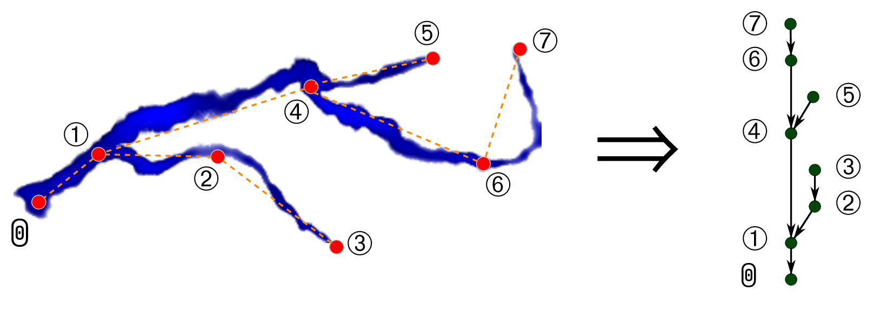

<!-- author: -->
<!--   - Gaurav Atreya -->
<!--   - Todd Steissberg -->
<!--   - Patrick A. Ray -->

# Summary
We present Network Analysis and Data Integration (NADI) System, a
developing software framework designed to facilitate river data
analysis and visualization. NADI comes with a Domain Specific
Programming Language (DSL) that has an intuitive syntax for network
metadata analysis as well as a generalized plugin system to run
user-defined functions on each node or the whole network. Plugins
provide seamless integration with GIS softwares and and other
programming languages. Our approach enables users to easily run
network based algorithms, check for inconsistencies in data, easily
visualize network metadata, etc. ultimately enhancing the accuracy and
comprehensiveness of hydrological models compared to using only
specialized software or general purpose programming languages.

# Statement of need
Hydrologic modeling, which involves integrating diverse data to simulate complex processes [@singhMathematicalModelingWatershed2002; @clarkImprovingRepresentationHydrologic2015; @loucksWaterResourceSystems2017], is hindered by manual and time-consuming data organization tasks, resulting on time drain, disengagement, information overload and human errors [@brunsTediousWorkDeveloping2024, @readStateScienceEvolving2021]
highlighting the need for intelligent computational assistance to reduce the workload and improve the efficiency and reproducibility of research in this field [@rosenbergNextFrontierMaking2020].

The widespread adoption of Geographic Information System (GIS) software has enabled confident decision-making, driven research innovation, and facilitated efficient 
data management and analysis in various formats [@devantierReviewGisApplications1993; @tsihrintzisUseGeographicInformation1996], particularly in hydrological modeling by integrating spatial and non-spatial data [@martinInterfacingGISWater2005].
Hydrologic modeling software has evolved by integrating component models and GIS, with developers focusing on improving GUIs and integration with existing tools [@bhattTightlyCoupledGIS2014], 
whereas specific hydrology-focused software [@rossmanOpenSourcingEPANET2010; @gironasNewApplicationsManual2010] lacks general applicability, highlighting the need for a balanced approach that combines specificity to hydrological
research questions with general capabilities.

A directed acyclic graph (DAG) also called directed tree [@deoGraphTheoryApplications2016] is one of the best way to represent the river network [@rinaldoTreesNetworksHydrology2006; @kuhnDesigningLanguageSpatial2015; @abed-elmdoustEmergentSpectralProperties2017], characterized by directed edges and a hierarchical structure, which offers 
efficient storage and retrieval of large databases compared to relational models [@demirOptimizationRiverNetwork2017; @knoxOpensourceDataManager2019], but it does not accurately capture complex river features such as braided rivers and 
bifurcations [@rinaldoTreesNetworksHydrology2006; @hiattGeometryTopologyEstuary2020].

The efficient automation of data processing and visualization tasks is crucial to streamline hydrological research, enabling researchers to focus on higher-level 
analysis and decision-making, while open standards such as WaterML [@taylorWaterML20DevelopmentOpen2013] and interoperability between databases can facilitate sharing and reuse of complex hydrological data [@atkinsonInternationalStandardConceptual2012; @rosenbergNextFrontierMaking2020; @swainNewOpenSource2016; @horsburghHydroShareSharingDiverse2016].

Our attempt of looking into it from the development of Domain specific language (DSL) comes from its several advantages, including improved code readability and maintainability due to the DSL's tailored syntax and 
semantics, increased efficiency through optimized algorithms and data structures, and enhanced collaboration among domain experts and programmers by providing a shared 
language and problem-solving framework [@mernikWhenHowDevelop2005]. Although Graphviz has made great progress on the visualization of graph [@gansnerOpenGraphVisualization2000; @ellsonGraphvizDynagraphStatic2004], it does not have the analytical capabilities. Hydrolang has the capabilities of analysis and visualization for hydrological applications, but it is web based [@erazoramirezHydroLangOpensourceWebbased2022]. Languages made for spatial analysis are either working with grid based system [@pullarMapScriptMapAlgebra2001; @kuhnDesigningLanguageSpatial2015].

Our choice in the language NADI was written comes from the features of Rust like memory safety [@fultonBenefitsDrawbacksAdopting2021; @xuMemorySafetyChallengeConsidered2021; @bugdenSafetyPerformanceProminent2022] --- which is a recommended practice for new programs [@FinalONCDTechnicalReport], its runtime performaces  [@zhangUnderstandingRuntimePerformance2023], and its macro system which gives us the metaprogramming features to make plugin development easier for users.


# Software Components
NADI System consits of 2 main components. NADI Geographic Information System (GIS) does the network detection and handles the interoperatibility with GIS system/files. While the NADI Task System is a Domain Specific Programming Language (DSL) that facilitates network analysis. NADI can be used from Command Line Interface (CLI), Graphical User Interface (GUI) using the NADI Integrated Development Environment (IDE), as a Rust library, or as a Python library.

NADI System consists of:

| Tool             | Description                                                 |
|------------------|-------------------------------------------------------------|
| NADI GIS         | Geographic Information (GIS) Tool for Network Detection     |
| NADI Task System | Domain Specific Programming Language (DSL)                  |
| NADI library     | Rust and Python library to use in your programs             |
| NADI CLI         | Command Line Interface to run NADI Tasks                    |
| NADI IDE         | Integrated Development Environment to write/ run NADI Tasks |
| mdbook-nadi      | Plugin for mdbook program that helps with documentation     |


NADI IDE consists of sub components like NADI help, text editor, network visualizer, terminal, etc. Some of which can also be ran independently of IDE. The figure below shows the GUI of NADI IDE, we can see the editor with tasks on left top, window to browse help on plugin functions on left bottom, terminal on top right, and network viewer and attribute browser on right bottom. These panes can be moves around, resized, turned on/off in a tiling window management style.


# Data Structures
Nadi has the following main data structures:

- **Node** is one point on the network. It can have input nodes, one output node, and attributes associated with it.
- **Network** consists of several interconnected nodes. It has to be DAG with only one outlet node. It can have attributes associated with it.
- **Attributes** are values that can be boolean, integer, float, string, array, table, etc.
- **Functions** are categorized into environment, network and node functions based on what they work on. For example, network function is run on a network, while node function is run at each node.
- **Expressions** are combination of attributes, variables, function calls, if--else, etc that can result in an attribute value.
- **Propagation** is how the node functions are called in a network, you can call them in different order, based on a list, or filtered by expression.
- **Task** in NADI is an execution body consisting of type of the task, optional output attribute name, and an expression that may or may not return a value. Only the top level function call on the expression can be a mutable call.
- **String Templates** are strings with variables and transformation functions inside them that can be used to render it into different strings dynamically based on network/node attributes.
- **Task Context** is the runtime environment for tasks to be run. It consists of a network, environmental variables and functions loaded from plugins.

Figure below shows how the different data types come together to generate a task and the task context. Each task runs in the task context, giving outputs, modifying the context, producing side effects (saving files), etc.



# Key Features

## Network Detection

NADI GIS can take streams vector file and points of interest and find the network connections (upstream/downstream dependencies) between the points. First the streams geometry is loaded into a R-Tree data structure [@guttmanRtreesDynamicIndex1984], then the points are snapped to the streams, and the direction of the streamflow in the streams file is used to find the connections.



## Network Analysis
Once we have a network information (generated through NADI GIS, or manually written) in a text file, we can load that, and the attributes into the NADI System and do various analysis. Network Analysis is done through the Task System, which is a DSPL designed to be more intuitive for network based analysis. For example, the following code represents the task that calculates the variable y as a cumulative sum of all the values of variable x at a node and its upstream points.

```
node<inputsfirst>.y = node.x + sum(inputs.y);
```
It is equivalent to:

$$
y_{i} = x_i + \sum_{j=0 \forall j \in I_i}^{n}{y_j}
$$

Where, \(x_i, y_i\) are values of \(x,y\) on node \(i\) and, \(I_i\) is the set of input nodes for node \(i\).

In pseudocode, it is equivalent to calling the following recursive function on the outlet of the network.

```
def calc_y(node):
    node.y = node.x
	for i in node.inputs():
	    node.y += calc_y(i)
	return node.y
```

Since y is dependent on y of input nodes, we need to call these functions recursively. The nadi syntax with `<inputsfirst>` part makes sure of that by running the expression for input nodes before the output node:

@atreyaEstimatingInfluenceWater2024 demonstrates a complex task like river routing model using the network structure. For more examples of the up to date codes refer to the [Nadi Book](https://nadi-system.github.io/).

## Extensibility
Nadi Task system supports two types of plugins for extending the use case to suit the need of its users.

- **Compiled Plugins** are shared libraries (`.so` files in Linux, `.dll`
in Windows, and `.dynlib` in MacOS) containing a list of functions that can be loaded into the main program during runtime. Those functions can then be called from the task system.
- **Executable Plugins** are independent programs/commands that are
run and their standard output is used to communicate values back to
the NADI system.

Furthermore, NADI can be used as a library in both Rust and Python, that can allow you to embed this into your own programs. For example, you can use python library, and pass python functions to nadi so that they are run for each node in the correct order.

Since plugins allow arbitrary code to be run in your computer, it is a security vulerability [@mesaUnderstandingVulnerabilitiesPluginbased2018], users should only load/use plugins that they know are from a safe provider, or is developed in house.

# Future Plans
Although NADI currently can store time-series data on the
nodes/network, it relies on user-developed plugins to facilitate
interaction with them. Future enhancements aim to expand its
capabilities by incorporating internal plugins and intuitive syntax
for working directly with time series data.  Specifically, we plan to
develop support for gaps in time-series data and implement methods for
filling these gaps using the network connectivity.

# Acknowledgements

Grant: #W912HZ-24-2-0049 Investigators:Ray, Patrick 09-30-2024 -- 09-29-2025 U.S. Army Corps of Engineers Advanced Software Tools for Network Analysis and Data Integration (NADI) 74263.03 Hold Level:Federal

# References
