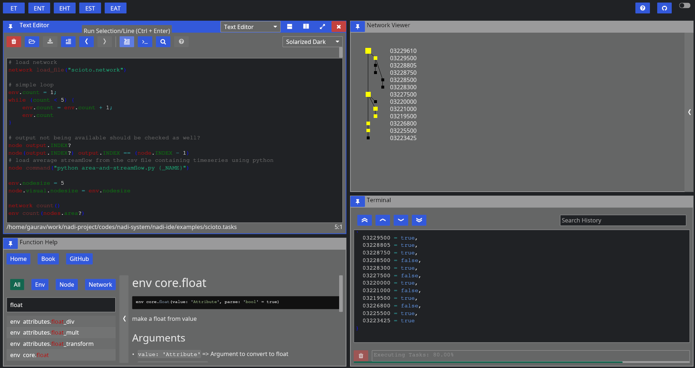
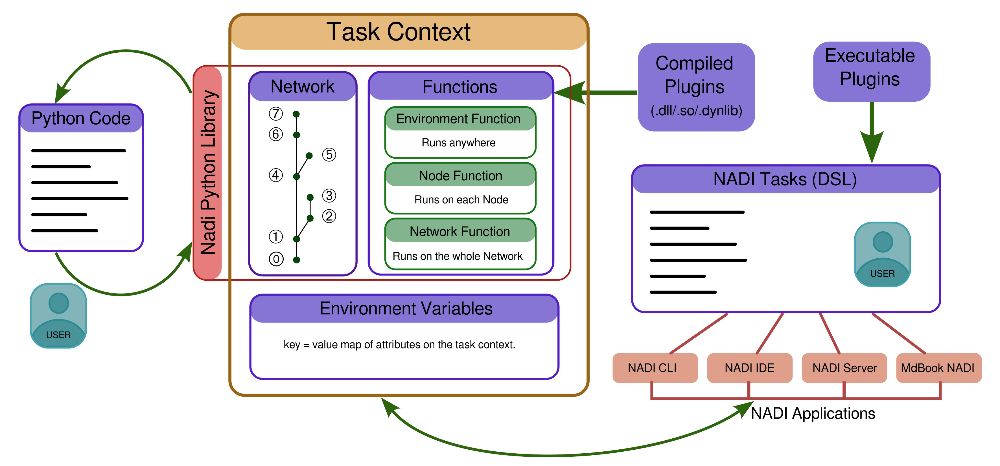

# Summary
We present the Network Analysis and Data Integration (NADI) System, a
developing software framework designed to facilitate river data
analysis. NADI System includes a Domain Specific Language (DSL) that
has a succinct and readable syntax for network metadata analysis as
well as a plugin system to run user-defined functions on each node or
the whole network. Plugins provide seamless integration with other
softwares and programming languages.

NADI System can be used from the Command Line Interface (CLI),
Graphical User Interface (GUI) using the NADI Integrated Development
Environment (IDE), as a Rust library, or as a Python library, allowing
users to write their plugins or programs.

# Statement of need
Hydrological analysis sometimes consists of data that is related to
points in the river, and frequently with relationships between
upstream/downstream points (e.g., higher correlation, mass
balance). Some analyses that benefit from the use of such
relationships are: finding inconsistencies in the data, filling
missing data, and visualization of metadata. There is a need for
intelligent computational assistance on a network-based system to
reduce the workload that further improves the efficiency and
reproducibility of research in this field
[@rosenbergNextFrontierMaking2020]. Specific hydrology-focused
softwares [@rossmanOpenSourcingEPANET2010;
@gironasNewApplicationsManual2010] lack general applicability, while
general-purpose programming languages might not have a succinct
syntax. This highlights the need for a balanced approach that combines
specificity to hydrological research questions with general
capabilities.

Domain Specific Languages (DSLs) have several advantages
including improved code readability and maintainability due to the
tailored syntax and semantics [@mernikWhenHowDevelop2005;
albuquerqueQuantifyingUsabilityDomainspecific2015]. Among DSLs that
have been developed for networks or hydrology, Graphviz focuses on
graph visualization [@gansnerOpenGraphVisualization2000;
@ellsonGraphvizDynagraphStatic2004], but lacks analytical
capabilities. Hydrolang offers both analysis and visualization tools
tailored to hydrological applications, although it is for web-based
platforms [@erazoramirezHydroLangOpensourceWebbased2022]. Languages
designed for grid-based spatial analysis
[@pullarMapScriptMapAlgebra2001; @kuhnDesigningLanguageSpatial2015]
are ill-suited for handling values like streamflow, which exhibit
partial spatial continuity along river courses, but do not fit neatly
into traditional 2D/3D spatial frameworks.

We present the NADI System that can load a river network as a Rooted Tree
Graph [@deoGraphTheoryApplications2016] --- which is known to be one
of the best ways to represent the river network
[@rinaldoTreesNetworksHydrology2006;
@kuhnDesigningLanguageSpatial2015;
@abed-elmdoustEmergentSpectralProperties2017] --- and provide the DSL
for network metadata analysis. Most components of the NADI System are
written in Rust [@klabnikRustProgrammingLanguage2023] due to the
memory safety [@fultonBenefitsDrawbacksAdopting2021;
@xuMemorySafetyChallengeConsidered2021;
@bugdenSafetyPerformanceProminent2022], runtime performances
[@zhangUnderstandingRuntimePerformance2023], and the macro system that
gives us the metaprogramming features necessary for the plugin development.

The figure below shows the GUI of NADI IDE, with the editor (left top), function help (left bottom), terminal (top right), network viewer, and attribute browser (right bottom). These panes can be managed in a tiling window style.



# Data Structures
The DSL is inspired by Python [@rossumPythonLanguageReference2010], array programming, and Rust. Important components in the DSL are:

- **Node** is one point on the network. It can have input nodes, one output node, and attributes associated with it.
- **Network** consists of several connected nodes. It can also have attributes associated with it.
- **Attributes** are values that can be boolean, integer, float, string, date, time, datetime, array, and table.
- **Functions** are categorized into environment, network, and node functions based on what they work on. For example, network function is run on a network, while node function is run on each node.
- **Expressions** are a combination of attributes, variables, function calls, conditionals, etc, that can result in an attribute value.
- **Propagation**: As a node function is called on each node, Propagation determines which nodes are called and in which order.
- **Task** in NADI System is an execution body consisting of the type of task, optional output attribute name, and expression or function call. Only the top-level function call on the expression can be mutable (changes task context).
- **Task Context** is the runtime environment for the DSL. It stores network, all the variables, and functions from plugins.

The figure below shows how the DSL is run through different NADI applications and the internal structures of the task context. Each task runs in the task context, giving outputs, modifying the task context, or producing side effects (e.g., saving files).



# Network Analysis
Network Analysis is done through the Task System by loading Network and Attributes into the Task Context then running Tasks. For example, the following code represents a task that calculates the variable y as a cumulative sum of all the values of variable x at a node and its upstream points.

```
node<inputsfirst>.y = node.x + sum(inputs.y);
```
It is equivalent to:

$$
y_{i} = x_i + \sum_{j \in I_i}{y_j}
$$

Where $x_i, y_i$ are values of $x,y$ on node $i$ and $I_i$ is the set of input nodes for node $i$.

@atreyaEstimatingInfluenceWater2024 demonstrates a complex task like river routing model using the network structure. For more concepts and up-to-date syntax, refer to the NADI Book [@nadi-book-070].

# Extensibility
NADI Task System supports two types of plugins for extending the use cases.

- **Compiled Plugins** are shared libraries (`.so` files in Linux, `.dll`
in Windows, and `.dynlib` in MacOS) containing a list of functions that can be loaded into the main program during runtime.
- **Executable Plugins** are independent programs that are run and
their standard output is used to communicate values back to the NADI
System.

Since DSLs have tradeoffs such as steep learning curves that can hinder adoption [@albuquerqueQuantifyingUsabilityDomainspecific2015], a Python library `nadi-py` is available to use the NADI Task System functions from Python (without the DSL).

Instructions on how to use them are available on the plugin developer guide and the Python library sections of the NADI Book [@nadi-book-070].

# Acknowledgements

Grant: #W912HZ-24-2-0049 Investigators: Ray, Patrick 09-30-2024 -- 09-29-2025 U.S. Army Corps of Engineers Advanced Software Tools for Network Analysis and Data Integration (NADI) 74263.03 Hold Level: Federal

# References
